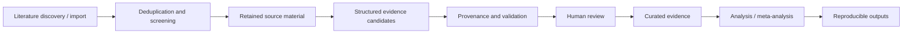

# Meta-analysis Platform

[](https://github.com/Niedharsan/meta-analysis-platform/actions/workflows/public-release.yml)

A reusable evidence-synthesis and meta-analysis platform for life-sciences research.

The system began with a conduction-system pacing (CSP) systematic review and meta-analysis, was generalized into a multi-project evidence platform, and was later used for a zebrafish CRISPR meta-analysis. It supports the path from literature retrieval to reviewed evidence and reproducible analysis outputs.

> **Limited public release:** This repository contains representative code, synthetic examples and technical documentation. It is not the complete research system and does not include private protocols, research data or production implementation details.

## Workflow



The full system provides project-scoped literature ingestion, study and report management, source retention, structured extraction, provenance, review history, statistical analysis, exports and forest plots. Project configuration and analysis evidence sets are versioned so that scientific decisions can be traced to the rules and evidence used at the time.

## AI boundary

The scientific data layer is not tied to one model provider. The current reference interface is a Custom GPT using authenticated OpenAPI Actions.

AI output is handled as proposed evidence. The server validates project and study scope, configuration, schema and provenance before a candidate can be materialized as a non-approved scientific row. Human review is still required before that row becomes curated evidence eligible for downstream scientific use. Corrections create auditable decisions and, where appropriate, successor versions rather than silently replacing prior records.

The public demo implements a small version of this boundary; it is not the production extraction or review engine.

## Scientific applications

| Application | Role in the platform's development |
| --- | --- |
| CSP systematic review and meta-analysis | Initial research use case; prompted the evidence database, review workflow and later generalization. The protocol and research data remain private. |
| Zebrafish CRISPR meta-analysis | Second real use case; added domain-specific guide, experiment and measurement records while reusing shared project, source, provenance and review infrastructure. |

- [CSP case study](docs/case-study-csp.md)
- [CRISPR case study](docs/case-study-crispr.md)

## Public demonstration

The example uses synthetic records only and the Python standard library:

```bash
python src/demo.py
```

Expected output:

```text
Candidate passes materialization checks: True
Materialized row review status:        draft_ai
Row is curated before human review:    False
Row is curated after human review:     True
```

Run the tests with:

```bash
python -m pip install -r requirements-dev.txt
pytest -q
```

## Technical documentation

- [Architecture](docs/architecture.md)
- [AI integration](docs/ai-integration.md)
- [Scientific governance](docs/scientific-governance.md)

The private implementation uses Python, FastAPI, Pydantic, SQLAlchemy, PostgreSQL, Alembic, Next.js, Docker and authenticated OpenAPI integrations.

## Why the full source is private

The repository is intended to show the system design and scientific safeguards without publishing active research methods or a reconstructable copy of the production platform. The complete backend and frontend, database migrations, extraction engine, prompts, API contracts and project configuration therefore remain private, along with the CSP protocol, CRISPR production configuration, source corpora, reviewer datasets and research results. The separate published-plasmid construction corpus is also outside this release.

See [LICENSE-NOTICE.md](LICENSE-NOTICE.md) for the release terms.
