# Meta-analysis Platform

[](https://github.com/Niedharsan/meta-analysis-platform/actions/workflows/public-release.yml)

A reusable evidence-synthesis and meta-analysis platform for life-sciences research.

The system began with a conduction-system pacing (CSP) systematic review and meta-analysis, was then generalized into a multi-project evidence platform, and was later used for a zebrafish CRISPR meta-analysis as a second scientific use case.

> **Limited public release:** This repository contains representative code, synthetic examples and technical documentation. It is not the complete research system and does not include private protocols, research data or production implementation details.

## What the platform does

A researcher starts with a systematic-review or meta-analysis question and defines the scientific information that needs to be collected.

The workflow is then:

```mermaid
flowchart LR
    A[Research question and extraction requirements] --> B[Search queries]
    B --> C[Literature APIs / database imports]
    C --> D[Deduplication and screening]
    D --> E[Retained papers, tables and supplements]
    E --> F[AI-assisted paper-by-paper extraction]
    F --> G[Structured evidence database]
    G --> H[Human review]
    H --> I[Curated evidence]
    I --> J[Statistical analysis / meta-analysis]
    J --> K[Excel, CSV, forest plots and analysis outputs]
```



For the current reference workflow, the AI client translates the approved review requirements into database-specific search queries, uses the platform API to run supported searches or register/import results from other literature databases, and then works through the retained papers individually.

The literature is **not sent to the model as one huge prompt**. The backend stores the records and source material. The AI reads each study/report in bounded source chunks, including retained tables and supplements where available, and proposes structured evidence fields with source quotations and locations.

The extracted data are stored in PostgreSQL first, not directly in Excel. Excel and CSV are generated later as project-specific exports of the structured evidence database. The project schema is designed around the information required for the review. If extraction repeatedly encounters a useful scientific concept that is not represented, it can be flagged for consideration rather than silently changing the schema.

Screening, scientific approval and final analysis decisions remain controlled steps. The AI can search, inspect and propose evidence, but it does not independently change the review protocol or make the final scientific decisions.

Where a review includes study-quality or risk-of-bias assessment, the platform also helps organize that process. It can record the study design, the appraisal/risk-of-bias framework being used, the source evidence behind reviewer judgements, disagreements and consensus, and the final approved assessment for export. The AI can assist with locating or structuring supporting evidence, but the final appraisal judgement remains a human scientific decision.

## AI client and scientific controls

The AI layer is replaceable. The current reference client is a **Custom GPT using authenticated OpenAPI Actions**.

A Custom GPT was used during development because it allowed long, interactive extraction workflows without separately metering every model call through a model API, which reduced direct API costs while the workflow was being developed and tested. This is a practical client choice, not a requirement of the architecture.

The same backend can instead be connected to an OpenAI, Gemini, Anthropic or other model API, or to another agent runtime, without redesigning the scientific database or review workflow. The AI communicates through typed API contracts; the backend remains responsible for authentication, project/study scope, source retention, provenance, review state and analysis.

AI-assisted extraction is kept separate from human scientific approval. The model can propose structured records and supporting source evidence, while the platform keeps those records reviewable until a researcher approves or corrects them.

## Scientific applications

| Application | Role in the platform's development |
| --- | --- |
| CSP systematic review and meta-analysis | Original research use case that drove literature search, extraction, study-quality/risk-of-bias assessment and statistical-analysis requirements. The exact protocol and research data remain private. |
| Zebrafish CRISPR meta-analysis | Second real use case that introduced guide-, experiment- and measurement-level evidence while reusing the same project, source, provenance and review infrastructure. |

- [CSP case study](docs/case-study-csp.md)
- [CRISPR case study](docs/case-study-crispr.md)

## Why the architecture was generalized

The first version was built around one real CSP review. As the workflow grew, the reusable parts became clear: projects, studies and reports, retained sources, structured extraction, provenance, review decisions and analysis outputs.

Instead of building a separate application for the zebrafish CRISPR review, those concepts were moved into shared infrastructure and the domain-specific scientific fields were kept project-specific. This allowed a clinical meta-analysis and a molecular-biology meta-analysis to use the same core evidence workflow.

## Public demonstration

The public example uses synthetic records only and demonstrates that AI-extracted data remains unapproved until the human review step:

```bash
python src/demo.py
```

Expected output:

```text
Candidate passes materialization checks: True
Materialized row review status:        draft_ai
Row is curated before human review:    False
Row is curated after human review:     True
```

Run the tests with:

```bash
python -m pip install -r requirements-dev.txt
pytest -q
```

## Technical documentation

- [Architecture](docs/architecture.md)
- [AI integration](docs/ai-integration.md)
- [Scientific governance](docs/scientific-governance.md)

The private implementation uses Python, FastAPI, Pydantic, SQLAlchemy, PostgreSQL, Alembic, Next.js, Docker and authenticated OpenAPI integrations.

## Why the full source is private

The repository is intended to show the system design and scientific safeguards without publishing active research methods or a reconstructable copy of the production platform. The complete backend and frontend, database migrations, extraction engine, prompts, API contracts and project configuration therefore remain private, along with the CSP protocol, CRISPR production configuration, source corpora, reviewer datasets and research results. The separate published-plasmid construction corpus is also outside this release.

See [LICENSE-NOTICE.md](LICENSE-NOTICE.md) for the release terms.
