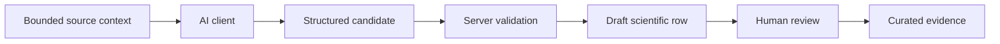

# AI integration

The scientific data layer does not depend on one model provider. The current reference interface is a Custom GPT using authenticated OpenAPI Actions.

## Responsibilities

### AI client

An AI client can read bounded source context, propose structured evidence, flag ambiguity and return verification findings. It does not write directly to the database or grant scientific approval.

### Evidence platform

The server handles authentication, project and study scope, configuration binding, source retention, provenance, schema checks, candidate state transitions, review history, curated records and analysis.

A candidate that passes server checks can be materialized with a non-approved status such as `draft_ai`. This preserves a typed record for review without representing model output as accepted evidence.

### Human reviewer

A reviewer accepts, rejects or corrects the scientific row. Approval requires attributable provenance or valid derivation lineage. Corrected rows and review decisions remain auditable.

## Automated verification

The full system includes contract-gated evidence-agent roles. Specialist output is checked by deterministic gates and, where configured, independent verifier roles bound to the exact specialist-output hash. A successful automated decision means review-ready, not human-approved.

## Replaceable interface

The AI client communicates through typed API contracts rather than owning the scientific schema or approval state. A different model or agent runtime can therefore use the same backend boundary.

Production prompts and complete OpenAPI contracts are intentionally excluded from this repository.
