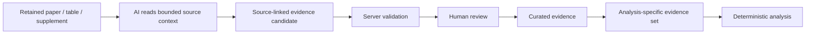

# AI integration

The AI is a client of the evidence platform, not the owner of the scientific database or review state.

The current reference client is a **Custom GPT using authenticated OpenAPI Actions**.

## Why a Custom GPT was used

During development, the workflow involved long, repeated literature-search and extraction runs. Using a Custom GPT provided an interactive AI client without separately metering every model call through a model API, which reduced direct API costs while the workflow was being developed and tested.

This was a practical deployment choice, not an architectural dependency.

The same backend can be connected to an OpenAI, Gemini, Anthropic or other model API, or to another agent runtime, without changing the scientific database, provenance model, review workflow or statistical-analysis layer.

```text
Current:
Custom GPT -> authenticated OpenAPI -> evidence platform

Alternative:
Model API / agent runtime -> authenticated API -> evidence platform
```

## What the AI does

The AI client can:

- interpret the research question and approved extraction requirements;
- help translate those requirements into database-specific literature searches;
- call the platform's search/import APIs;
- work through retained papers individually;
- read bounded source chunks rather than receiving the whole literature corpus at once;
- propose structured evidence fields;
- attach supporting source text and locations;
- flag missing, ambiguous or potentially useful information;
- participate in automated verification workflows where configured.

## What the backend does

The evidence platform handles:

- authentication;
- project and study/report scope;
- literature and source retention;
- configuration and schema enforcement;
- provenance;
- candidate state;
- review history;
- curated scientific records;
- analysis-specific evidence eligibility;
- deterministic statistical analysis and output generation.

The AI therefore cannot simply turn a response into accepted scientific evidence.

## Candidate to curated evidence



A candidate can be well formatted and still be scientifically wrong. The system therefore keeps AI output in a proposed/non-approved state until the required review has taken place.

Where the full system uses automated specialist/verifier roles, passing those checks means the evidence is ready for review; it does not mean the AI has approved itself.

## Why the evidence is stored before Excel

The primary evidence store is PostgreSQL, not an Excel workbook.

This makes it possible to preserve relationships between:

- projects;
- studies and reports;
- source material;
- extracted values;
- review decisions;
- corrections;
- analysis eligibility.

Excel and CSV are generated later as project-specific exports. That allows the output to be formatted around the information needed by the researcher/client without losing the structured provenance and review history underneath it.

## Replaceable interface

Because the AI communicates through typed API contracts, model selection is separated from scientific state.

Changing the model client should not require rebuilding:

- the literature database;
- the evidence schema;
- the review workflow;
- provenance tracking;
- the statistical-analysis services.

Production prompts and complete OpenAPI contracts are intentionally excluded from this public repository.
