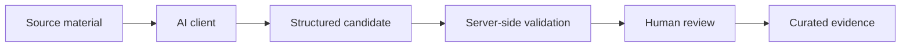

# AI integration

The evidence platform is designed so that the scientific data layer does not depend on one model provider.

A Custom GPT using authenticated OpenAPI Actions has been used as a reference client. The model reads bounded source material, proposes structured evidence and submits candidates back to the server. The server retains project scope, provenance, validation and review state.

## Separation of responsibilities

### AI client

The model may:

- read bounded source context;
- extract structured candidate evidence;
- flag ambiguity or missing information;
- propose corrections;
- perform independent checking where configured.

### Evidence platform

The server is responsible for:

- authentication;
- project/study scoping;
- source and provenance storage;
- schema validation;
- candidate state transitions;
- review history;
- curated scientific records;
- analysis and export.

### Human reviewer

The reviewer retains control over acceptance, rejection and correction of scientific evidence.

## Why the integration is replaceable

The AI client communicates through structured contracts rather than writing directly to the scientific database. Another hosted model or agent runtime can therefore replace the current client without redesigning the evidence schema or approval boundary.

The complete production OpenAPI contracts and prompts are intentionally not included in this public repository.
