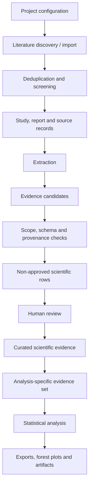

# Architecture

The full system is a project-scoped evidence platform, not a database for one review.

## Evidence flow

## Main layers

### Project configuration

Studies, variables and workflows are scoped to a research project. Configuration versions record the scientific rules used for extraction and analysis and whether a change requires revalidation or re-extraction.

### Literature and sources

Search runs retain their source, query metadata and import counts. Imported citations are normalized and deduplicated. A study can have multiple reports, and source assets, parsed sections and tables remain linked to the report from which they came.

### Candidates and validation

Automated extraction creates candidate records. Candidates are checked against project and study scope, a frozen configuration, typed scientific schemas and source provenance. An accepted candidate may be materialized as a scientific row with a non-approved review status; materialization is not human approval.

The full implementation also supports contract-gated specialist and verifier roles. Verifier output is bound to the exact specialist result it checks. Passing automated gates makes output ready for review, not approved.

### Review and provenance

Human review controls approval, rejection and correction. Approval requires attributable evidence or valid derivation lineage. Corrected records can create a successor version while preserving the prior row and decision history.

### Analysis

Evidence inclusion belongs to a particular analysis rather than being a permanent property of a scientific row. Analysis records retain selected evidence and calculated values, and generated artifacts are stored with integrity metadata.

### Clients

The scientific data layer is provider-neutral. A Custom GPT using authenticated OpenAPI Actions is the current reference AI client; the browser application and API remain separate from that model interface.

## Full-system technology

- Python, FastAPI and Pydantic
- SQLAlchemy, PostgreSQL and Alembic
- Next.js
- Docker
- authenticated OpenAPI integrations

## Public boundary

This repository documents the architecture through reduced examples. It does not contain the complete schema, services, migrations, API contracts, project configurations or research data.
