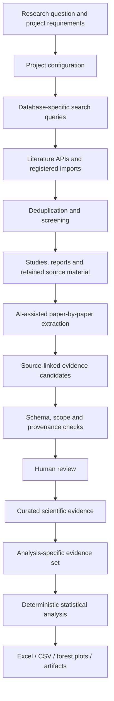

# Architecture

The full system is a project-scoped evidence-synthesis platform. It was built around a real systematic review/meta-analysis workflow and later generalized so that different life-sciences projects can reuse the same search, source, evidence, review and analysis infrastructure.

## End-to-end workflow



## 1. Research question and project configuration

Each review is represented as a project. The project defines the scientific information that needs to be collected and the rules needed to interpret that information.

The configuration can include project-specific variables, units, groups, comparisons, extraction requirements and analysis settings. Configuration changes are versioned so that later results can be traced to the rules that were active when the evidence was extracted or analysed.

The exact CSP protocol and project-specific scientific rules are private and are not included in this public repository.

## 2. Literature search and import

The AI client can translate user-approved review requirements into database-specific search queries. The platform then runs supported literature searches through configured APIs or records/imports results from databases that are accessed separately.

Searches and imports are handled by the backend rather than by placing all search results into one model prompt. Search metadata, imported citations and job state are retained so large searches can be resumed and audited.

Imported citations are normalized and deduplicated before the screening/inclusion workflow.

## 3. Studies, reports and retained sources

The platform distinguishes a **study** from an individual **report/article** because one scientific study may produce several publications, follow-up reports or supplements.

The backend retains the source material used for extraction and keeps it attached to the report it came from. Depending on availability, this can include article text, sections, tables, figure captions and supplementary material.

This prevents a value extracted from one report from losing its source context or being incorrectly attributed to another report from the same study.

## 4. AI-assisted extraction

The retained literature is not sent to the AI all at once. The AI client works through the selected studies/reports individually and reads source material in bounded chunks.

For each paper it proposes structured scientific evidence such as measurements, effect estimates, study characteristics or domain-specific records. Each proposal includes the relevant source location and supporting text where required.

The extracted information is written into a structured database workflow first. Excel is an output format, not the primary evidence store.

If a scientifically useful concept repeatedly appears but is not represented by the current project schema, it can be flagged for consideration rather than allowing the AI to silently invent a new field or alter the database structure.

## 5. Validation and human review

AI-generated evidence is treated as proposed evidence, not accepted evidence.

Before a candidate can enter scientific review, the backend checks things such as:

- whether it belongs to the correct project and study/report;
- whether it matches the current configuration and expected data structure;
- whether the required source provenance is present;
- whether deterministic scientific validation rules pass.

The full private implementation also contains specialist/verifier workflows for selected extraction tasks. Automated verification can make a record ready for review, but it does not grant scientific approval.

A human reviewer then accepts, rejects or corrects the proposed evidence. Review decisions and corrections remain auditable rather than silently overwriting previous scientific history.

## 6. Curated evidence and analysis

Human-approved evidence becomes part of the curated scientific evidence base.

Approval alone does not mean a record belongs in every meta-analysis. Each analysis defines its own eligible evidence set based on the scientific question, comparison, variable, timepoint and other analysis rules.

Once the evidence set is fixed, deterministic software performs the statistical calculations. The LLM is not asked to improvise pooled effects, confidence intervals or forest plots.

## 7. Outputs

The platform can produce project-specific outputs such as:

- Excel workbooks;
- CSV exports;
- analysis tables;
- forest plots;
- analysis artifacts and inclusion/exclusion records.

The exports are generated from the structured evidence database, so they can be tailored to the fields needed by the research project or client while retaining the underlying provenance and review history.

## AI client is replaceable

The current reference AI client is a **Custom GPT connected through authenticated OpenAPI Actions**.

A Custom GPT was used during development because it provided a practical way to run long interactive literature-extraction workflows without separately paying per model API call/token during each development run. This reduced direct model API costs while the system was being built and tested.

The Custom GPT is not part of the scientific data model. It is simply one client of the backend API. It can be replaced by an OpenAI, Gemini, Anthropic or other model API, or by another agent runtime, without redesigning the database, provenance model, review workflow or statistical-analysis layer.

Conceptually:

```text
Current:
Custom GPT -> authenticated OpenAPI -> evidence platform

Alternative:
Model API / agent runtime -> authenticated API -> evidence platform
```

## Main technical layers

- **AI client:** interprets the research task, helps construct searches, reads bounded source material and proposes structured evidence.
- **FastAPI / Pydantic:** typed API contracts and server-side validation.
- **PostgreSQL / SQLAlchemy:** structured evidence, provenance, review state and project data.
- **Alembic:** controlled database-schema evolution.
- **Next.js:** browser interface.
- **Deterministic analysis services:** statistical calculations, evidence eligibility and output generation.
- **Docker:** persistent application deployment.

## Public boundary

This repository documents the architecture through reduced examples and synthetic data. It does not contain the complete backend/frontend, migrations, extraction engine, production prompts, full API contracts, project configurations, research corpora or private CSP protocol.
