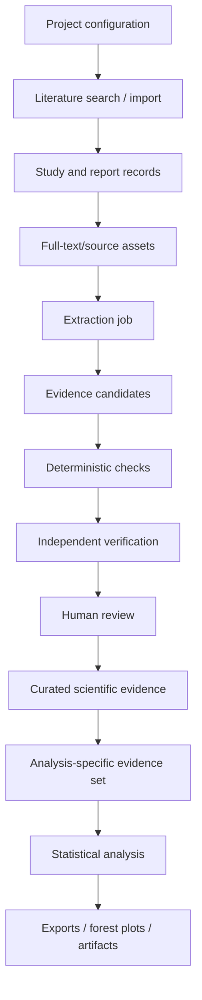

# Architecture

The full system is a project-scoped evidence platform rather than a single-review database.

## High-level flow

## Main layers

### 1. Project layer

Each research project has its own configuration and study membership. The generalized implementation supports reusable scientific concepts such as variables, study groups, comparisons, observations, effect estimates and statistical tests.

Project configuration is versioned so an extraction or analysis can be tied to the scientific rules that were active when it ran.

### 2. Source layer

A scientific study may be represented by multiple reports. Source records can retain identifiers, article sections, tables and imported full text or document text. Evidence provenance points back to the report/source location used to support a scientific claim.

### 3. Candidate layer

AI-assisted extraction produces candidates rather than directly changing approved scientific evidence. Candidate identity, project scope, source references and proposed scientific payload are recorded separately from curated rows.

### 4. Review layer

Candidates pass through validation and review transitions. Corrections are explicit. Approved scientific records retain provenance and review state; rejected or superseded candidates remain part of the audit history.

### 5. Analysis layer

Analysis inclusion is kept separate from evidence storage. This allows the same reviewed evidence to participate in different analyses without permanently marking a scientific row as universally included or excluded.

### 6. Client layer

The platform backend is not tied to one language model provider. A Custom GPT using authenticated OpenAPI Actions has been used as one reasoning client. The scientific database, validation logic and review state remain server-side.

## Technology

The private implementation uses:

- Python / FastAPI
- Pydantic
- SQLAlchemy
- PostgreSQL
- Alembic migrations
- Next.js frontend
- Docker
- authenticated OpenAPI integrations

## Public-release boundary

This document describes the reusable architecture only. Project-specific scientific protocols, exact search strategies, private datasets, production prompts and complete implementation details are not part of the public release.
